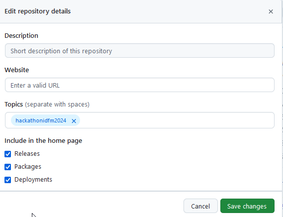
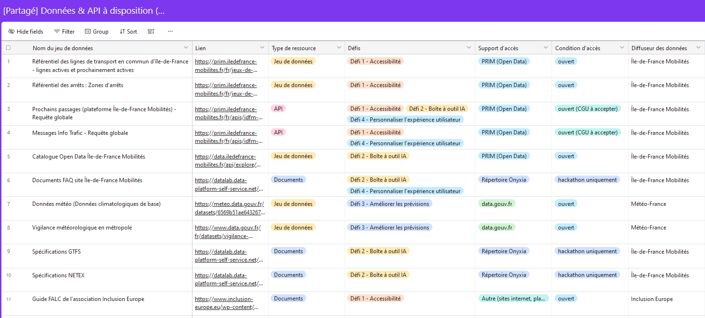

# Guide des participant·e·s au Hackathon IA et Mobilités

Bienvenue dans le Hackathon IA et Mobilités, organisé par Île-de-France Mobilités.

## Comment l’usage de l’IA peut-il améliorer les services mobilités ?

C'est la question que vous allez vous poser les 21 et 22 novembre 2024 à Paris. 

Vous allez travailler en équipe afin de **faire émerger des idées et des prototypes afin d’explorer la pertinence de l'IA et d’en étudier l’usage et les limites dans le domaine de la mobilité.** Île-de-France Mobilités vous mets à disposition un certain nombre de ressources, dont un Datalab : Onyxia.

Ce document va vous servir de guide tout au long de ce Hackathon et dans sa phase de préparation.

## Sommaire
1. [Le programme](https://github.com/IleDeFranceMobilites/hackathon_ia_mobilites_2024?tab=readme-ov-file#le-programme)
2. [Les défis](https://github.com/IleDeFranceMobilites/hackathon_ia_mobilites_2024?tab=readme-ov-file#les-d%C3%A9fis)
2. [Les ressources et les outils](https://github.com/IleDeFranceMobilites/hackathon_ia_mobilites_2024?tab=readme-ov-file#les-ressources-et-les-outils)
3. [Vos résultats](https://github.com/IleDeFranceMobilites/hackathon_ia_mobilites_2024?tab=readme-ov-file#vos-r%C3%A9sultats)
4. [La FAQ](https://github.com/IleDeFranceMobilites/hackathon_ia_mobilites_2024?tab=readme-ov-file#foire-aux-questions-faq)

## Le programme

### Jour 1 - Jeudi 21 (début à 9h)

| Heure  | Activité                                             |
|--------|------------------------------------------------------|
| 9h     | Accueil                                              |
| 9h30   | Mot d’accueil de la présidente du jury Hélène Brisset|
| 9h45   | Présentation de la plateforme et des ressources dédiées|
| 10h05  | Rappels logistiques et installation                  |
| 10h15  | Finalisation des équipes                             |
| 10h45  | **Lancement des projets**                                |
| 12h45  | Pause déjeuner                                       |
| 13h45  | Reprise des projets                                  |
| 19h    | Fin de journée                                       |

### Jour 2 - Vendredi 22 (début à 8h)

| Heure  | Activité                                             |
|--------|------------------------------------------------------|
| 8h     | Accueil, reprise des projets                         |
| 12h30  | Pause déjeuner                                       |
| 13h30  | Reprise des projets                                  |
| 15h    | **Fin des travaux**                                      |
| 15h15  | Pitchs                                               |
| 16h20  | Délibérations                                        |
| 16h50  | Mot de conclusion, annonce des résultats et photos avec les lauréat·e·s |
| 17h30  | Cocktail                                             |
| 19h    | Fin de journée                                       |

## Les défis

Pendant ces deux jours, vous allez répondre en équipe de 4 à 7 personnes à un défi. L'objectif est de proposer un projet qui répondre à un des 4 défis proposés. [Les défis sont présentés dans ce document](/docs/HIAM2024%20-%20Pr%C3%A9sentation%20des%20d%C3%A9fis.md). 

- **Défi 1** - Améliorer l'**accessibilité** des services de mobilité
- **Défi 2** - Construire une **boîte à outils** pour accélérer le développement de l’IA au service des usagers
- **Défi 3** - Améliorer les **prévisions** au service des mobilités
- **Défi 4** - **Personnaliser** l’expérience utilisateur des services numériques au voyageur

**Défi transveral frugalité** : Comment la frugalité des systèmes d’IA utilisés peut-elle améliorer mon projet ?

## Les ressources et les outils

#### Le Slack

C'est sur le slack qu'aurons lieu les principaux échanges ([lien d'invitation au slack](https://join.slack.com/t/dataiailedefr-mya4689/shared_invite/zt-2u2bo2v10-YcUO~FlnNwl~W0mLCZLBUQ)). Chaque canal possède une description dans un message épinglé.
- **00-general** : pour échanger librement sur le Hackathon IA et Mobilités, et poser vos questions à l'équipe d'organisation.
- **01-welcome** : pour vous présenter quelques mots : vous, vos domaines d'expertise, le défi qui vous intéresse et si vous être à la recherche d'une équipe
- **03-ressources-outils-données** : pour échanger sur les ressources, outils et données mises à disposition par Île-de-France Mobilités et ses partenaires
- **04x-défis** : pour échanger sur les 4 défis proposés lors de ce hackathon
- **05x-équipe-nom-équipe** : pour échanger en équipe

Une fois ajouté sur le slack, **vous pouvez vous présenter dans le canal 01-welcome et vous mettre à la recherche d'une équipe** dans les canaux dédiés aux différents défis. 

Les équipes se composeront librement, mais les Organisateurs se réservent les droits de rééquilibrer les profils et niveaux entre les équipes ! Une fois les équipes constituées, vous aurez alors rejoins le salon de votre équipe. C'est l'occasion pour commencer à vous mieux vous connaître et échanger sur la découverte des ressources et données mises à diposition. 

#### Le répertoire de code

Chaque équipe aura son propre **répertoire de code public** (Github ou Gitlab) pour développer son projet. Le repertoire sera également 

Un fois un service d'IDE déployé sur Onyxia (voir ci-dessous) vous pouvez cloner votre répertoire pour travailler dessus.

Deux choses : 
- **Pour le README, veuillez [utiliser ce modèle](/docs/HIAM2024%20-%20Template%20README%20des%20projets.md)** (il vous servira pour l'envoi de votre projet à la fin du Hackathon).
- Ajoutez le topic *hackathonidfm2024* à la description de votre répertoire (voir image ci-dessous)

#### La plateforme Onyxia et ses services

Onyxia est la plateforme que vous allez utiliser tout au long de ces deux jours. 

C'est une application web open-source développée par l’Insee conçue pour les data scientists en leur offrant un environnement de travail de pointe. En substance, Onyxia propose un catalogue de services (VSCode, Jupyter, etc...) que vous pouvez lancer depuis la plateforme.

1. Se connecter à [Onyxia](https://datalab.data-platform-self-service.net). Il faut créer un compte avec l'adresse email avec laquelle vous vous êtes inscrits au Hackathon. 
2. Une fois connecté à Onyxia vous avez accès votre projet personnel. Vous serez ajouté au projet dédié au hackathon **"dlb-hackathon"** (voir image ci-dessous).
3. **Toutes les équipes travaillent à partir de ce projet**. C'est dans ce projet que sont partagées en tant que variables d'envrionnement les clés des différentes APIs et ressources mises à disposition.

Vous pouvez ensuite **lancer des services** (par exemple un service Visual Studio Code Python), et les lier au repositoire de code de votre groupe. Nommez bien vos service avec le nom de votre équipe "EQUIPE X".

 Attention, les services ne sont pas stables si ils sont éteins, alors vous perdez leurs configurations. 

Pour en savoir plus : 
 - Voir [ce tutoriel](https://docs.onyxia.sh/user-doc/setting-up-your-dev-environment-in-onyxia) pour configurer automatiquement le lancement d'un sevice.
 - Lire ce [rapide document](/docs/HIAM2024%20-%20Organisation%20et%20lancement%20des%20services%20Onyxia.md) pour savoir comment sont gérées les secrets d'accès aux services Azure et OpenIA sur Onyxia

Les principaux services proposés : 
| Nom du service | Description | Catégorie de service | Espace de lancement |
|----------------|-------------|----------------------|----------------------|
| Jupyter python | IDE Jupyter avec les libraires data python pré-installées | Environnements de développement |dbl-hackathon : une instance par équipe|
| VSCode python | Visual Studio Code avec les libraire data python pré-installées | Environnements de développement |dbl-hackathon : une instance par équipe|
| Cloudbeaver | pour vos bases de données | Base de données |espace personnel (non partageable)|
| OpenWebIU | une interface web "no-code" (ou pas) pour créer des chatbots personnalisés à partir d'une grande diversité de modèles de langage | Spécifique au Hackathon |dbl-hackathon : une instance par équipe ([tutoriel](/docs/HIAM2024%20-%20Config%20OpenwebUI.md)) |
| Elastic | pour vos bases vectorielles et stockages de documents JSON | Base de données |dbl-hackathon : une instance commune à toutes les équipes|

#### Les ressources à votre disposition

Vous disposez d'un certain nombre de ressources à votre disposition. **Le but n'est pas de toutes les consulter**, mais qu'elles puissent vous faire gagner du temps lors de la réalisation de vos projets. 

##### Tableau récapitulatif des ressources 

| Ressource | Description | Lien |
|-----------|-------------|------|
| Les ressources IA | Accès aux ressources et modèles IA | [lien tuto Onyxia](/docs/HIAM2024%20-%20Organisation%20et%20lancement%20des%20services%20Onyxia.md) |
| Les données et documents | Liste de toutes les données et documents | [lien](https://airtable.com/appGp6Hwf0NrmXQ9L/shrnmQYmL0lDKgS76/tblC8dlSqeplzyg0A) |
| Le notebooks de prise en main des données | Notebook pour prendre en main certains jeux de données | [lien](/notebooks/HIAM2024%20-%20Guide%20données%20hackathon.ipynb) |
| Les snippets de code | Snippets de code pour rapidement prendre en main les APIs | [lien](https://github.com/IleDeFranceMobilites/hackathon_ia_mobilites_2024/blob/main/notebooks/HIAM2024%20-%20Snippets%20de%20code.ipynb) |
| Les exemples (notebook) | Exemple de RAG et guide de stockage des données | [lien RAG](/notebooks/HIAM2024%20-%20Template%20de%20RAG%20sur%20base%20Elastic.ipynb), [lien base vectorielle](/notebooks/HIAM2024%20-%20Template%20alimentation%20base%20Elastic.ipynb) et [lien guide stockage](/notebooks/HIAM2024%20-%20Guide%20utilisation%20stockage%20Onyxia%20-%20v2.ipynb) |

##### Les ressources IA

Les équipes d'Île-de-France Mobilité ont mis à disposition des accès aux clés API de modèles d'Open AI via les services Azure. Pour y avez accès dans les sercrets de votre équipe dans Onyxia ([pour en savoir plus](/docs/HIAM2024%20-%20Organisation%20et%20lancement%20des%20services%20Onyxia.md))

Vous avez également accès au service [OpenWebUI](https://openwebui.com/) via Onyxia.

Vous pouvez aussi jeter un oeil aux [modèles mis à diposition par Github](https://docs.github.com/fr/github-models/prototyping-with-ai-models) pour le prototypage (limites assez basses).

##### Les données et documents

Pour entraîner vos algorithmes, visualiser des données, utilser des APIs ou encore alimenter votre RAG on a sélectionné pour vous des **données et documents**. 

Ils sont accessible [depuis ce lien](https://airtable.com/appGp6Hwf0NrmXQ9L/shrnmQYmL0lDKgS76/tblC8dlSqeplzyg0A). Vous pouvez **filtrer les données sur le défi qui vous intéresse**. Certaines ressources sont issues du [Catalogue PRIM](https://prim.iledefrance-mobilites.fr/fr), d'autres sont directement ajoutés dans les fichiers du projet Onyxia 'dlb-hackathon'.

##### Les notebook de prise en main des données

Certains jeux de données ont été spécialement mis à disposition pour le Hackathon, et se trouvent dans les fichiers partagés sur Onyxia. Les équipes d'île-de-France Mobilités ont [partagé dans un notebook](/notebooks/HIAM2024%20-%20Guide%20données%20hackathon.ipynb) quelques fonctions pour prendre en main les données. Le notebook présente aussi quelques données intéressantes.

##### Les snippets de code

Ces **[snippets de code](https://github.com/IleDeFranceMobilites/hackathon_ia_mobilites_2024/blob/main/notebooks/HIAM2024%20-%20Snippets%20de%20code.ipynb)** vont vous permettre de gagner du temps dans la prise en main des ressources à disposition et de l'écosystème data d'île-de-France Mobilités. Par exemple, pour réaliser les appels PRIM d'Île-de-France Mobilités.

#### Les exemples (notebook)
Les équipes d'Île-de-France Mobilités ont préparé un [**exemple de Retrieval Augemented Generation RAG**](/notebooks/HIAM2024%20-%20Template%20de%20RAG%20sur%20base%20Elastic.ipynb), avec un exemple de création et d'[**alimentation d'une base vectorielle**](/notebooks/HIAM2024%20-%20Template%20alimentation%20base%20Elastic.ipynb), qui permet d'enrichir les connaissances d'un modèle de langage avec des données spécifiques. 

Vous pouvez **lancer les notebooks exemple directement sur Onyxia**. Pour cela, **assurez vous d'être connectés sur Onyxia et d'être sur le projet "dlb-hackathon"**, puis lancez un service type VSCODE-Python et importez-y les [notebook exemples](/notebooks/HIAM2024%20-%20Template%20de%20RAG%20sur%20base%20Elastic.ipynb) du dossier notebook de ce projet github.

Vous avez également à disposition un [guide d'utilisation du stockage des données sur Onyxia](/notebooks/HIAM2024%20-%20Guide%20utilisation%20stockage%20Onyxia%20-%20v2.ipynb) (S3 MinIO, DuckDB, etc...).

#### La documentation
Comme d'habitude, lisez les documentations en ligne des services utilisés !

## Vos résultats
Vos projets viendront alimenter la communauté Data IA et mobilités. **Les réalisation seront publiées sous licences libres** (type MIT) et publiées sur **un répertoire de coce public** (Github ou Gitlab). 

Concrètement, vous allez réaliser :
- un [support de présentation](https://drive.google.com/drive/folders/1vLBmRBrxpfShEAYoV-zvcG5gqgtjXH0v?usp=drive_link) pour le pitch ;
- le projet dans le répertoire de code public : des notebooks, applications, templates, jeux de données …. Le [modèle de README](/docs/HIAM2024%20-%20Template%20README%20des%20projets.md) doit vous servir à documenter votre projet ;
- tout autre forme qui pourra valoriser votre projet ! 

**Chaque équipe présentera son projet au jury à l’oral**, dans un temps limité. Vous avez 4 minutes pour pitcher votre projet, suivies de 2 minutes de Q&R.

Rappel : 
- **Pour le README, veuillez [utiliser ce modèle](/docs/HIAM2024%20-%20Template%20README%20des%20projets.md)** (il vous servira pour l'envoi de votre projet à la fin du Hackathon).
- Ajoutez le topic *hackathonidfm2024* à la description de votre répertoire (voir image ci-dessous)

## Foire Aux Questions (FAQ)

Cette FAQ regroupe les questions les plus fréquentes ou susceptibles d’être posées par les participant·e·s du hackathon. Elle sera enrichie au fur et à mesure selon les besoins.

1. Peut-on utiliser un autre environnement de développement que celui fourni par l’organisation ?

 
Vous pouvez tout à fait utiliser un environnement de développement en local (PyCharm, Neovim…), autre que le datalab Onyxia. Néanmoins, il est demandé aux participant·e·s de valider ce point en amont avec l’organisation de l’événement. En revanche, il est interdit d’utiliser des plateformes de type OpenAI, GCP, ou autre instance cloud/IA publique ou privée. Ces cas posent en effet la question du transfert à "l'extérieur" de certains jeux de données encore non publics.

 

2. Quelles données seront accessibles pour ce hackathon ?

 
Les données utiles aux défis sont accessibles via ce <a href="https://airtable.com/appGp6Hwf0NrmXQ9L/shrnmQYmL0lDKgS76">lien</a>. Vous aurez accès à des données déjà ouvertes et disponibles sur des portails open data, notamment le portail <a href="https://prim.iledefrance-mobilites.fr/fr/catalogue-data">PRIM</a>, mais également à des données exclusives au hackathon. C’est le cas par exemple des données Transilien, RATP, GPSEO, ou des données de validation plus récentes que celles actuellement publiées par IDFM. Pour ce qui concerne ces données exclusives au hackathon, le 6.5 du règlement exclut de les rendre publiques, de les copier, de les extraire à des fins privées ou de les partager à des tiers. 

 

3. Les ressources mises à disposition par l’organisation seront-elles accessibles après le hackathon ?

 
Les données ouvertes spécifiquement pour le hackathon ne sont pas encore à un niveau de qualité qui permet de les partager en externe. Elles ne seront donc plus utilisables au terme de l’événement. Mais l'objectif est de les ouvrir rapidement dans la foulée du hackathon.

 

4. Peut-on participer au hackathon si on ne peut pas être physiquement présent·e pendant les deux jours de l’événement ?

 
Non, il n’est pas possible de participer au hackathon si vous ne pouvez pas physiquement être présent·e avec votre équipe au Liberty Living Lab pendant les deux jours. Il nous paraît important d’être ensemble pendant cet événement, et de favoriser des échanges interpersonnels physiques. De notre point de vue, quand on participe à un hackathon, c’est aussi pour les rencontres qu’on peut y faire.

 

5. Qu’est-il prévu pour la restauration pendant l’événement ?

 
L’organisation se charge de petits déjeuners d’accueil et des repas du midi. Il vous sera demandé vos préférences (par exemple végétarien ou non) en amont de l’événement. En revanche, nous ne prenons pas en charge les dîners. 

 

6. Comment puis-je trouver une équipe ?

 
La constitution des équipes s’effectue en amont de l’événement. Certaines équipes sont déjà constituées, d’autres pas encore. Si vous n’avez pas d’équipe, nous vous recommandons de vous présenter dans le slack du hackathon et indiquer le défi qui vous intéresse le plus. Les échanges se font par ce canal. L’organisation aidera également à rapprocher les participant·e·s et les équipes en cours de constitution (n’hésitez pas à les contacter sur le slack).

 

7. Comment rejoindre le Slack de l’événement ?

 
Pour rejoindre le slack, il suffit de suivre ce <a href="https://join.slack.com/t/dataiailedefr-mya4689/shared_invite/zt-2u2bo2v10-YcUO~FlnNwl~W0mLCZLBUQ">lien</a>. Nous vous invitons à vous présenter dans le canal #01-welcome. Vous y trouverez les autres participant·e·s et tous les échanges passeront par cet outil.

 

8. Où puis-je trouver les infos pratiques, les ressources et les liens du hackathon ? 

 
Vous trouverez le guide des participant·e·s sur notre <a href="https://github.com/IleDeFranceMobilites/hackathon_ia_mobilites_2024/tree/main">GitHub</a>. Il contient les informations pratiques (horaires, lieu, etc.), la description des défis proposés, le tuto pour se connecter à la plateforme Onyxia, des snippets de code… Bref, toutes les ressources dont vous aurez besoin !

