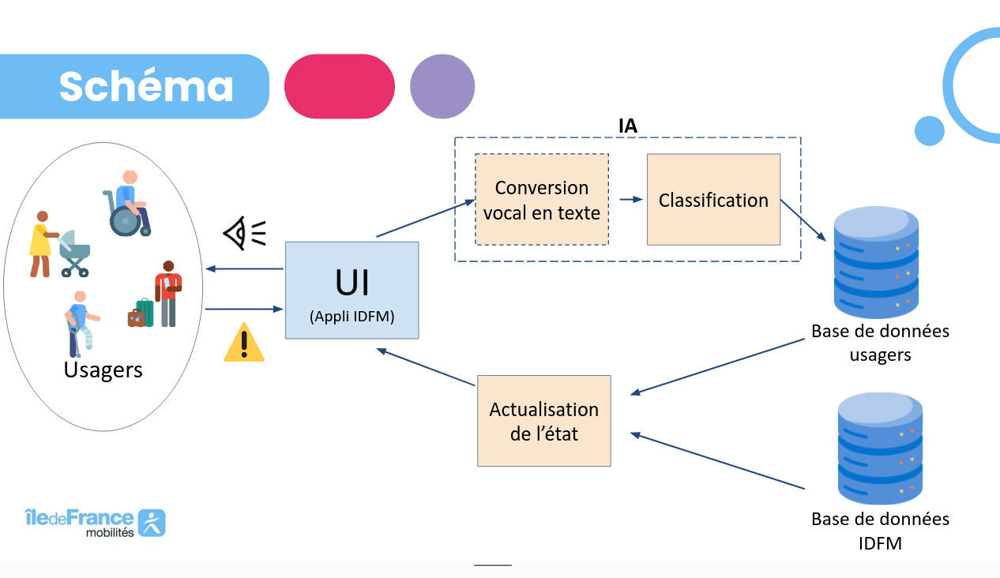

# Elevate Us

Ce projet a été développé dans le cadre du [Hackathon IA et Mobilités](https://www.iledefrance-mobilites.fr/actualites/hackathon-2024-ia-et-mobilites), organisé par Île-de-France Mobilités les 21 et 22 novembre 2024. Pour en savoir plus, voici le [Guide des participants et participantes](https://github.com/IleDeFranceMobilites/hackathon_ia_mobilites_2024).

Notre équipe désirait se concentrer sur le dysfonctionnement des équipements générant un problème d'accessibilité aux usagers. Pour cela, nous proposons d'intégrer au calculateur d'itinéraire d'Île de France une solution interactive et communautaire considérant l'état de fonctionnement de ces derniers.

## Le problème et la proposition de valeur

Notre problématique est le **manque de visibilité des dysfonctionnements d’équipements sur un parcours**.  
En conséquence, il est fréquent de noter que les personnes en mobilité réduite évitent d'utiliser les transports publics par crainte de perdre du temps ou d'être bloqué.  
Nous observons également que les usagers valides sont passifs face à de telles pannes et manque de moyens pour contribuer à leur résolution. D'ailleurs, nous avons estimer que les ascenseurs en gare tombaient en moyenne en panne tous les 2j15h. Donc, nous supposons d'une manière générale que les équipements sont assez fragiles.

Notre solution **s'adresse ainsi à tous les usagers d'Île de France Mobilités**, avec un bénéfice tout particulier pour les personnes en mobilité réduite. Par exemple, lors des jeux para-olympiques énormément d'utilisateurs en mobilité réduite ont empruntés les transports en commun. Leur temps de voyage peut être plus conséquent qu'un utilisateur régulier, surtout par période d'affluence.

### La solution

Elevate Us est une solution pour identifier le parcours le plus court, en temps réel, tout en indiquant les équipements fonctionnels. Au quel cas, l'utilisateur peut signaler le problème grâce à un commentaire ou un message vocal. Lorsque plusieurs signalements sont recensés, alors une indication de dysfonctionnement est générée dans une base de données reliée à IDFM et un avertissement apparaît sur l'application des usagers.

Les données mobilisées proviennent de la plateforme Île de France Mobilités ou du datalab (lorsqu'il s'agissait de données privées).
Elles sont focalisées sur les équipements (état, fonctionnement et localisation des ascenseurs et/ou des escalators) que nous avons fusionné avec la liste des gares.



### Les problèmes surmontés
- **Des données ou des APIs parfois difficile à prendre en main** (mais nous avons eu l'aide de l'organisation).  
Exemple : beaucoup de données concernant les ascenseurs / peu concernant les escalators.

- **Différents angles d'approche**  
Notre solution est transversale à plusieurs défis.
    Il nous a fallu un temps de réflexion en commun pour déterminer notre trajectoire de travail.

- **Une équipe avec différents niveaux techniques et de connaissances**  
Nous avons échangé en amont au Hackathon pour nous présenter et faciliter le dialogue au top départ du jeudi matin. 

### Et la suite ? 

Nous utilisons actuellement un LLM pour classifier les réclamations, un classifieur spécialisé demanderait moins de ressources mais demandait trop d'efforts d'entraînement pour la durée du Hackathon.

La base de données ainsi créée servira peut-être à mieux prédire les dysfonctionnements des ascenseurs et des escalators.

Davantage de données sur la position des équipements permettrait d'augmenter la qualité de lecture de l'interface.

## Installation et utilisation


```bash
python -m streamlit run main.py
```
## La licence

Le code et la documentation de ce projet sont sous licence [MIT](LICENSE).